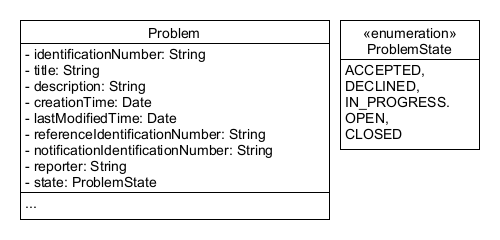
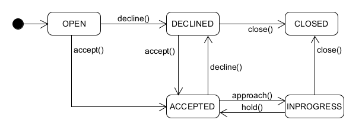

# Bounded Context Entity Relation View
This diagram represents a problem entity, it contains a state-pattern which allows to change its state on command. It also enables us to extend its modelling with ease.

A description of the identification number called "in" in this diagram can be found in the [Ubiquitous Language](https://git.scc.kit.edu/-/ide/project/cm-tm/cm-team/3.projectwork/pse/docsc/tree/english-translation/-/pages/ubiquitous_language.md/).

ProblemStates and their transitions are described in the following state diagram.

